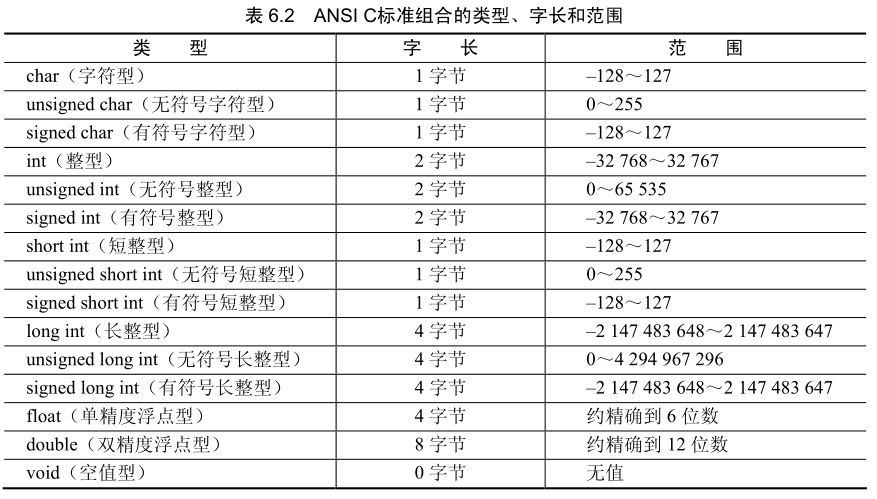
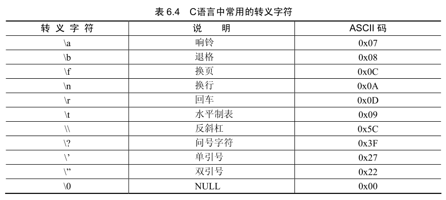

数据类型、运算符和表达式是 C 语言的 3 个基本组成部分。数据类型决定了如何将数据存储到计算机的内存中，运算符是数据之间执行何种运算的代号，而表达式则是 C 语言最基本的语法。

## C语言的数据类型

C语言有5种基本的数据类型，分別是字符型、整型、单精度浮点型、双精度浮点型和空类型。在不同的操作系统或硬件平台中，这些数据类型的值域范围和所占用的内存的数量有关。这种差异影响了C语言的可移植性能。但如果能深入地理解数据类型的构成，则可以最大程度地避免该问题。

### 基本类型的字长与范围

字长是指数据所占用内存的数量，字长决定了数据类型的值域，即范围。以字符型为例，ANSI C 标准中的字符型的长度是 1 字节（8 位二进制编码），可计算其值域为± 2 ^ 7 取值范围为 -128 ~ 127。计算机所使用的 ASCII 字符编码共有 128 个元素，所以用字符型可将全部元素表示出来。依次类推，ANSI C 标准中其他基本类型的字长与范围见表 6.1。


由于硬件平台和操作系统的不同，数据类型的字长可能与上表不同。例如，运行在 AMD64 架构的 Linux 系统中，整型的长度为 4 字节。要获得当前系统环境中数据类型的字长，可运行下列程序。

```c++
#include <stdio.h>

int main() {
    printf("char length %d\n", sizeof(char));
    printf("int length %d\n", sizeof(int));
    printf("long length %d\n", sizeof(long));
    printf("float length %d\n", sizeof(float));
    printf("double length %d\n", sizeof(double));
    return 0;
}
```

该程序使用 sizeof 函数返回数据类型的字长，sizeof 函数的返回值为整型数据。

### 聚合类型与修饰符

C 语言支持聚合类型，包括数组、指针、结构体、共用体（联合）、位域和枚举。聚合类型构成了复杂的数据结构，用以描述事物的各种属性。除 void 类型外，基本类型的前面可以有各种修饰符。修饰符用来改变基本类型的意义，以便更准确地适应各种情况的需求。修饰符如下：

- signed（有符号）
- unsigned（无符号）
- long（长型）
- short（短型）

signed、short、long 和 unsigned 修饰符适用于字符和整数两种基本类型，而 long 还可用于 double unsigned 和 signed 修饰符分别表示无正负值符号和有正负值符号的数据类型中，计算机中原始数据类型使用的是二进制数，如果要表示正负值符号则需要用 1 位存储空间。以字符型为例，无符号字符型取值值域是 28，那么其取值范围为 0 ~ 25，有符号字符型将 1 位用于存储符号，取值值域是 2，那么范围为 -128 ~ 127。表 62 给出了所有根据 ANSI C 标准而组合的类型、字长和范围。



因为数据类型的默认定义是有符号数，所以 singed 修饰符通常可省略。某些编译器允许将 unsigned 用于浮点型，如 unsigned double。但这一用法降低了程序的可移植性，故建议一般不要采用。

为了使用方便，GCC 编译程序允许使用整型的简写形式：short int 表示为 short，即 int 可省略。

表示正数时，最大能表示的值总是比值域少 1，这是因为将 0 作为正数看待，0 占用了一个取值空间。

## 常量与变量

顾名思乂，常量是运算中不能改变数值的数据类型，变量是可改变数值的数据类型根据需要，可将一些在程序运行中不必改变数值的类型定义为常量，这样也可避免因修改数值造成程序错误。任何改变常量数值的操作都会引起编译错误。

### 标识符命名

C 语言程序中，每个数据都有其标识符，如常量名、变量名、函数名或宏名。标识符是数据或程序模块的名字。一般情况下，只能通过标识符操作对应的数据或模块。ANSI C 规定了标识符的命名规则，第一个字符必须为下划线或英文字母，其后的字符必须为下划线、数字或英文字母。例如，year、month01、day 都是正确的命名，而 2year、mon ！ tho1、day-one 是错误的命名。另外，标识符命名时要避免与 C 语言关键字相同。

标识符的长度不受限制，但 ANSI C 标准考虑到程序的移植性，要求不同源代码间相互引用的外部名称必须能够由前 8 个字符进行区分。这是因为对某些仅能识别前 8 个字符的编译程序而言，外部名 calcountl、calcount2 将被当作同一个标识符处理。同一个源代码文件中的标识符称为内部名称，ANSI C 标准要求内部名称至少能通过前 31 个字符区别。虽然常量名、变量名、函数名或宏名代表程序的不同部分，但不能使用同一名称。

C 语言严格区别英文字母的大小写，例如变量名 number、Number 和 NUMBER 是不同的标识符。

### 常量

C 语言中的常量有 4 种基本类型：`#define` 定义的符号常量；字符、字符串常量和数值常量；常量变量；枚举常量。

符号常量通常岀现在文件的开始，它更像是编辑器的字符串替换操作。下面例子是 `#define` 的用法

```c++
#define PI 3.14
#define AUTHOR "Rustle Karl"
```

字符、字符串常量和数值常量是直接在源代码中岀现的字符、字符串和字符，因为程序运行时它们会在内存中占据固定内存，所以认为它们是常量。以下示例是使用字符、字符串常量和数值常量的用法。

```c++
i = 1;
c = 'D';
s = "Rustle Karl"; // 赋值符号右边的是常量
```

常量变量是一种特殊的常量，它实际是用 const 修饰符限制了变量改变其值。下例是量变量的定义方法

```c++
const int count = 54;
```

枚举常量是一种聚合类型，它有多个成员，默认情况下第一个成员所代表的数值是 0，后面的成员所代表的数值在前面成员的数值上加 1。也可以在定义枚举常量时为成员赋值示例代码如下：

```c++
#include <stdio.h>

int main() {
    enum weekday {
        MON = 1, TUE, WED, THU, FRI, SAT, SUN
    };

    printf("%d", SUN);

    return 0;
}
```

### 变量

运算中可以改变数值的数据类型称为变量。每个变量拥有唯一的名字，在内存中占据一定的存储单元，在该存储单元中存放变量的值。所有的 C 变量必须在使用之前声明，声明变量的一般形式如下。

```c++
数据类型 变量名;
```

```c++
int age;
```

声明变量和为变量赋值也可从两个语句合并为一个语句，如 `int count=25;`。也可以同时声明多个变量并为其赋值，变量或表达式间以逗号分隔，如 `int count=25,length;`。

变量在被使用前必须先赋值，未赋值前，其值可能会是对应数据类型中的任意一个数字。如果变量被声明，但在整个程序中都未对其赋值或使用，则 GCC 编译器会给出一个警告信息。

## 整型数据

没有小数位或指数的数据类型被称为整型数据，根据使用方法的分类，整型数据可分为整型常量和整型变量。根据定义或显示的数制分类，可分为十进制、八进制和十六进制。

```c++
[正负符号]十进制整数值
```

其中十进制整数值可以是从0~9的一个或多个十进制数位，第1位可以是正负符号，但不能是0。八进制整型常量的表述形式：

```c++
[正负符号]0八进制整数值
```

八进制整数值可以是从0~7的一个或多个八进制数位，正负符号后的第1位必须是0十六进制整型常量的表述形式是：

```c++
[正负符号]0x十六进制整数值 //使用小写
[正负符号]0X十六进制整数值 //使用大写
```

正负符号后第1位必须是0，第2位必须是小写x或大写X。十六进制的1015分别用字母A~F表示。例如十进制数162，用八进制表示为0242，用十六进制表示为0xA2。

正值整型常量可省略正负符号，负值整型常量必须在数值前加上负号“-”来说明。

整型常量的数据类型取决于数值本身，如果常量表达式没有使用负号，编译器会认为该常量为无符号数。编译器会根据整型常量的长度自动分配存储空间，甚至可以认为常量的数据长度是没有上限的。但这并不代表任意大的数都能被C语言处理八进制和十六进制整型常量在存储方式上与十进制数并无区别，只是定义时使用了不同的表述方法。八进制和十六进制整型常量的存储空间长度也由数值来决定，并且可以存在负值。

### 整型变量

为变量命名的过程称为“声明”。C 语言规定，变量使用前必须声眀。整型变量用 int 修饰符声明。不同类型的整型数据也能进行算术运算。

## 浮点型数据

浮点型数据又称实型数据，是一个以十进制表示的符号实数。符号实数的值包括整数部分、尾数部分和指数部分。

## 字符型数据

字符型数据用于在计算机上保存字符编码和一些文本控制命令。多个字符型数据和字符串结束符组成的序列称为字符串。Linux系统与其他大多数操作系统一样，支持 ASCII编码对字符进行编码，每个字符占用1字节的存储空间。

### 字符常量

字符常量是指用一对单引号包围起来的一个字符。字符常量中的单引号只起定界作用并不表示字符本身。单引号中的字符不能是单引号和反斜杠，它们必须用转义字符表示。

每个字符在 ASCI 编码里有唯一的整数值，例如，0 的值为 0x30，A 的值为 0x41。因此，两个字符常量间的运算，或字符常量与整型变量间的运算是允许的，代码如下：

```c++
short a, b;
a = 'c' + '1';
b = '9' - 9;
```
### 字符串常量

字符串常量是指用一对双引号包围起来的一串字符。例如 "China" 和 "8860000 等都是字符串常量。双引号只起定界作用，其中不能包含双引号，字符串也不能是唯一一个反斜杠。

C 语言中，字符串常量存储在内存中时，系统自动在字符串的末尾加一个字符串结束符，即 ASC Ⅱ中编码为 0 的字符 NULL，常用 0 表示。因此在程序中，长度为 n 个字符的字符串常量，在内存中占有 n+1 个字节的存储空间。

例如，字符串 "China" 有 5 个字符，作为字符串常量 "China" 存储于内存中时，共占 6 个字节，系统自动在后面加上 NULL 字符，其存储形式见表 6.3。


要特别注意字符串与字符串常量的区别，除了表示形式不同外，其存储性质也不相同，字符 A 只占 1 个字节，而字符串常量 A 却占 2 个字节。

### 转义字符

转义字符用于表示 C 语言中有特殊意义的符号，或者 ASCI 码字符集中无法显示的控制符号。例如，单引号和双引号，以及换行符、字符串结束符。转义字符用反斜杠加上个字符组成，也可用该字符的 ASCI 码来代替字符的意义。例如 0 用于表示字符串结束符，n 表示换行符。表 6.4 给出了 C 语言中常用的转义字符。



在 C 语言中使用转义字符 `\ddd` 或者 `\xhh` 可以方便灵活地表示任意字符。`\ddd` 为斜杠后面跟 3 位八进制数，这 3 位八进制数的值即为对应的八进制 ASCII 码值。`\xhh` 后面跟 2 位十六进制数，这 2 位十六进制数即为对应的十六进制 ASCII 码值。

### 符号常量

使用预处理命令 `#define` 定义的常量称为符号常量。为了在程序中易于区别，符号常量通常使用大写英文字母作为标识符，定义的形式如下：

```
#define <符号常量名> <常量>
```

其中，符号常量名遵循 C 语言标识符的定义方法，常量值可以是任何基本数据类型。

符号常量的作用是提髙程序的易读性，便于程序的设计和调试。如果某一数值或字符串在程序中使用次数较多，或者代表特定的意义，那么可将其定义为符号常量。如果该数值或字符串需要修改，只需要对预处理命令中定义的常量值进行修改即可。

### 字符变量

字符变量用来存放 ASCII 码符号，一次只能存放一个符号，因为单个字符变量的存储空间只有 1 字节。字符变量的定义形式如下：

```c++
char c;
c = 'm';
```

另外，给字符变量赋值也可直接使用 ASCII 码值。例如：

```c++
c = 0x6D;
```

与字符常量一样，字符变量也可以进行数学运算。通过查阅 ASCII 码表，可以发现大写字母码值与相同小写字母之间的差为 0x20，即 A 加上 0x20 的结果为 a。当字符变量进行数值运算时，给字符变量赋的值大于字符变量的值域，会产生周期性变化。

```c++
char c1, c2, c3;
c1 = 357;
c2 = -251;
c3 = 'm' + 256;
printf("%d, %d, %d\n", c1, c2, c3);
```

在 C 语言里，这个程序是正确的，3 个变量中储存的十进制数值分别是 101、5 和 109。

变量 c1 的值等于 357 减去 256，c2 的值是 -251 加上 256，c3 的值加上了 256 后并未变化变量越界时呈现岀周期性变化。产生周期性的原因在于计算机底层的数值表示方法，所有数值都被保存为二进制，而数值超过值域后产生的高位薮值被省略。例如，变量 c3 的二进制值为 0l101101，当它加上 256 后，计算机需要 2 个字节来保存计算结果 000000101101101。而字符变量的存储空间只有 1 字节，所以前面的高位数值被省略，计算结果与原值相同。这一特性也是所有整型变量都具备的。

## 运算符

运算符是程序中用于数值运算的操作符。C 语言的运算符可分为算术运算符、关系与逻辑运算符和位操作运算符这 3 类。

### 算术运算符

算术运算符用来完成基本的数值运算，如加、减、乘和除，它们可用于所有的数据类型。表6.5列出了C语言所有的算术运算符。


其中，“-”运算符既能表示两个操作数的减法运算，又能对一个操作数进行取反运算，将正数变为负数，或将负数变为正数。取模运算是取得两数相除的余数。

### 自增和自减

自增和自减体现了 C 语言语法的简洁，自增就是在原值的基础上加一，自减则是减一。

```c++
int a =5 //声明整型变量并赋值
printf("a=%d\n", a++) //输出变量的值后，再使变量自增
printf("a=%d\n", ++a) //变量自增后，再输出变量的值
```

### 关系和逻辑运算符

关系运算符用于比较两个数据间的差异，大于、小于和等于是基本的关系运算符。逻辑运算符用于数值间的逻辑演算，与、或、非是基本的逻辑运算符。关系运算符和逻辑运算符关系密切，因此常划为一个类别。C 语言中可用的关系和逻辑运算符见表 6.6。


### 位操作符

位操作是计算杋底层的运算方式，与组成计算机的逻辑电路运行模式一致，C 语言支持全部的位操作符。因为 C 语言的设计目的是取代汇编语言，所以它必须支持汇编语言所具有的运算能力。位操作是对字节或字中的位进行测试、置位或移位处理，这里字节或字是针对℃标准中的字符型和整型数据类型而言的。位操作不能用于浮点型、空值或其他复杂类型。表 6.8 给出了位操作的操作符


位操作中的与、或和 1 的补码的真值表与逻辑运算等同。唯一不同的是位操作是逐位进行运算的，即比较操作数的每一个二进制位。如果两个操作数长度不一，则将较短的操作数高位全部补 0。位操作增加了异或运算。表 6.9 是异或运算的逻辑真值表。


### 问号操作符

问号操作符是最简单的条件语句，格式如下

条件表达式？表达式 1：表达式 2 ；

问号操作符是 C 语言内唯一的三目运算符。其作用是在条件表达式为真的情况下，执行表达式 1，否则执行表达式 2。

### 逗号操作符

逗号操作符用于将多个表达式连接在一起。逗号操作符的左侧总是作为空值，如果要取得整个表达式的值，只有逗号表达式右侧的值是有效的，如下例所示。

```c++
int a =5, b =7; //声明整型变量并赋值
b = (a+b, a-b); //用表达式的结果为变量b赋值
```

代码第二行，b 的值变为 -2。因为第一个表达式 a+b 的计算结果作为空值被忽略，第二个表达式 a-b 的计算结果被赋值给了 b。因为逗号操作符的优先级比赋值操作符优先级低，所以必须使用括号。

### 优先级


## 表达式

表达式由运算符、常量及变量构成。C语言的表达式基本遵循一般代数规则。

### 表达式中的类型转换

同一表达式中的不同类型常量及变量在运算时需要变换为同一数据类型。C语言的编译程序将所有操作数变换为与最大类型操作数相同的类型，如下列源代码所示。

```c++
char c = 85; //声明字符型变量并赋值
int i = 3; //声明整型变量并赋值
float f = 6.234; //声明单精度浮点型变量并赋值
double d =2.7174, result; //声明双精度浮点型变量并赋值
result = c / i + f * d - (f + i); //用表达式的结果为 double 型变量赋值
```

该例中，表达式内最大的数据类型 double 成为该表达式返回值的数据类型。但并非开始就将表达式转换成同一类型再计算，而是根据需要步步转换，这种特性能影响计算结果，如图6.1所示。

)

### 构成符 cast

可以通过称为 cast 的构成符强迫表达式变为特定类型。其一般形式如下

```c++
（数据类型）表达式
```

```c++
int d = 5, result;
float f = 6.32;
result = d * (int) f; //将变量强制转换为整型再计算
```

此例的计算结果为 30，在运算之初已将变量 f 强制转换为整型。假若没有使用构成符，表达式 result = d * f 的结果为 31，因为变量首先被转换成单精度浮点型运算，然后赋值时再被转为整型。

### 空格与括号

为了增加可读性，可以随意在表达式中插入 Tab 和空格符。

括号可改变表达式的执行顺序，可用的括号有小括号和中括号，中括号的优先级稍低。

```c++
result = c / [(i + f) * d - (f + i)];
```

小括号内的表达式首先被计算，然后是中括号里的表达式。冗余的括号并不导致错误或减慢表达式的执行速度，因为编译后的机器代码里已根据括号编排好了计算顺序，多余的括号被忽略。笔者鼓励使用括号，它可使执行顺序更清楚一些。

### C语言中的简写形式

C 语言为常用赋值语句提供了简写形式。

这种简化的形式适用于 C 语言中的二目运算符，包括加、减、乘、除和取模。

```c++
x = x + 5;
x += 5;
```
