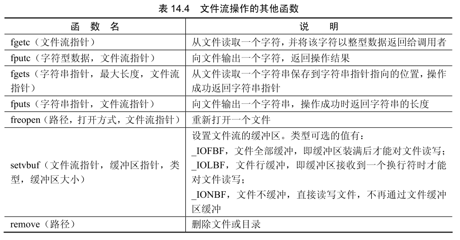

文件在 Linux 系统中是一个广泛的概念。在前面的章节中提到过，Linux 将所有的硬件设备都当作文件来处理。因此，文件的输入与输出(IO)操作也是对设备进行操作的基础。

## 非缓冲文件操作

非缓冲文件操作针对于小规模文件的读写，或者是实时设备，例如调制解调器、连接于串口的工业设备。执行非缓冲文件操作后，应用程序将立即获取或传送数据。非缓冲文件操作的函数只有两个，分别是 read 函数和 write 函数，这些函数通过文件标识符找到文件。在介绍这些函数前，首先介绍 3 个操作系统预先分配的文件标识符。

- 0：标准输入，即通过终端输入。
- 1：标准输出，即通过终端输出。
- 2：标准错误，系统中存放错误信息的堆栈。

### 读取文件

read 函数用于从文件中将信息读取到指定的内存区域中。该函数的一般形式是：

```c++
read(文件标识符，内存块指针，内存块长度);
```

文件标识符可使用 open 函数获得，或者使用系统预先分配的文件标识符。内存块指针用于指定 read 函数读取数据的保存位置，内存块长度在 read 函数的第 3 个参数里定义。

read 函数的返回值是它实际读取的长度，如果返回值为 0，表示它没有读取任何数据，运行错误时则返回 1。例如下例：

```c++
#include <fcntl.h>// open
#include <unistd.h>
#include <stdio.h>

#define LENGTH 2000//内存块最大长度

int main() {
    char c[LENGTH];
    int f, i, j = 0;
    f = open("/usr/include/gnu-versions.h", O_RDONLY, LENGTH);
    if (f != -1) {
        i = read(f, c, LENGTH);
        if (i > 0) {
            for (; i > 0; i--) {
                putchar(c[j++]);
            }
        } else {
            perror("read");
        }
    } else {
        perror("open");
    }

    return 0;
}
```

### 写入文件

write 函数用于将指定长度的数据写入文件中，该函数的一般形式是：

```c++
write(文件标识符，内存块指针，内存块长度);
```

函数的返回值是它实际写入的长度，如果返回值为0，表示它没有写入任何数据，运行错误时则返回1。例如下例：

```c++
#include <fcntl.h>// open
#include <unistd.h>
#include <stdio.h>

#define LENGTH 2000//内存块最大长度

int main() {
    char c[LENGTH];
    int f, i;
    puts("Input:");
    if ((i = read(0, c, LENGTH)) < 1) {
        perror("read error");
        return 1;
    }

    f = open("outfile.txt", O_RDWR | O_CREAT, 0664);
    if (f != -1) {
        if (write(f, c, i) != i) {
            perror("write error");
        }
        puts("save file success");
        close(f);
    } else {
        perror("open error");
    }

    return 0;
}
```

该程序从文件标识符为 0 的设备读取数据，0 是系统预定义的文件标识符，该标识符代表标准输入，即终端，所实现的操作与 gets 或 scanf 函数相当。然后，write 函数将终端中输入的字符输出到指定文件中。

### 随机读写文件

open 函数内部有一个隐藏的文件位置指针，该指针指向文件正在读写的位置。在未指定的情况下，该位置处于文件的开始。如果在 open 函数参数中加入副标志 O_APPEND，那么打开的文件时指针将指向文件末端，后一次输入的数据将保存在文件末尾。源代码如下：

```c++
//打开或新建一个文件，从文件末端操作
f = open("outfile.txt", O_RDWR | O_CREAT | O_APPEND, 0664);
```

如果要在程序运行中指定指针的具体位置，可使用 Iseek 函数实现。该函数的一般形式是：

```c++
Iseek(文件标识符，偏移长度，起始位置);
```

偏移长度用于设置指针的位置，起始位置是定义指针位置的参考坐标，该坐标可用3个枚举常量表示，见表14.1。


当起始位置为当前位置或文件末端时，偏移长度允许为负值，表示指针向前移动。但偏移长度不能超过文件的首和尾限定的范围，否则将造成严重错误。lseek 函数返回值是指针位置，操作失败则返回-1。

## 缓冲文件操作

缓冲区是为程序分配的内存块，在进行数据量比较大且不要求实时性的 IO 操作时，部分数据被置于缓冲区中，只有当数据的长度快要超过缓冲区范围或时间周期达到时，这些数据才被送入指定的位置。基于缓冲区的文件 IO 操作减少了对设备的物理数据接口访问次数，从而使大量数据的 IO 操作的系统开支减少，并将实际读写速度提升。标准输入输出库定义了文件流结构指针 FILE *作为文件的标识，同时提供了一系列缓冲文件操作函数。有 3 个文件流是系统预定义的：

- stdin：标准输入。
- stdout：标准输出。
- stderr：标准错误。

### 打开与关闭文件流

打开文件流操作的函数是 fopen，该函数与系统调用函数 open 的作用相似，它主要用于文件和终端的输入输出方面，所以并不能对文件权限进行操作。该函数的一般形式是：

```
fopen(路径，打开方式);
```

打开方式是一组字符串，定义方法见表14.2。


字母 b 表示操作的是二进制文件，但在 Linux 系统中并不区分文本文件和二进制文件，所以两种操作实际是一样的。如果函数执行成功，返回值是文件流指针，否则返回 NULL 当文件不需要使用时，可用 fclose 函数将文件关闭。该函数的一般形式是：fclose(文件流指针)。当 fclose 函数执行时，所有放在缓冲区等待写入的数据都将被写入到文件中如果数据未能被成功保存，fclose 函数返回 -1，否则返回 0。这两个函数的用法如下例所示。

### 读取与写入文件流

读取文件流可使用函数 fread，该函数的一般形式是：

fread(缓冲区指针，长度，数量，文件流指针);

缓冲区在程序中定义，定义后将指针作为参数传递给 fread 函数。参数中的长度是指每次读取到缓冲区内数据的长度，参数中的数量是读取操作的最多次数。该函数的返回值是读取到缓冲区的次数，这个数字可能会小于参数中定义的最多次数。如果文件的长度大于 fread 函数实际读取数据的长度，那么实际读取数据的总和为参数中长度与数量的乘积。

写入文件流可使用函数 writer，该函数的形式与 fread 相同。这两个函数不适用于操作结构化数据的场合，例如操作数据库中的表，原因是 forteo 函数写的文件可能无法在不同硬件平台之间移植。

如果待写入的数据存储在缓冲区中，而又要立即将缓冲区的数据写入文件，可使用 flush 函数实现。该函数的一般形式是 ffush(缓冲区指针);。

```c++
#include <stdio.h>

#define SIZE 65536 //用于定义缓冲区大小，64KB
#define LENGTH 1024//用于定义每次读取的长度，1KB

int main() {
    char buf[SIZE] = {0};//定义缓冲区
    FILE *fp;//定义文件流指针
    fp = fopen("/usr/include/gnu-versions.h", "r");//打开文件
    if (fp != NULL) {
        //读取数据到缓冲区
        if (fread(buf, LENGTH, SIZE / LENGTH, fp) >= 0) {
            puts("read success");
        } else {
            perror("read failed");
            return 1;
        }
    } else {
        perror("open failed");
    }

    fclose(fp);//关闭被读取的文件

    //以读写模式打开文件（该文件必须是已存在的）
    fp = fopen("copy", "rw+");
    if (fp != NULL) {
        //将缓冲区内的数据写入文件
        if (fwrite(buf, LENGTH, SIZE / LENGTH, fp) >= 0) {
            fflush(fp);
            puts("write success");
        } else {
            perror("write failed");
            return 1;
        }
    } else {
        perror("open failed");
    }

    if (fclose(fp) != -1) {
        puts("close success");
    } else {
        perror("close failed");
    }

    return 0;
}
```

上例代码的作用实际是复制一个文件的全部内容，但 fopen 函数没有新建文件的功能，所以必须先建立一个空白文件作为数据写入的目标。该程序所设缓冲区的大小为 64KB，因此只能复制长度在 64KB 以内的文件。在 fread 和 fwrite 函数所设置数量可设置为缓冲区大小除以每次读取长度的商，这样就能保证将数据读满缓冲区。

缓冲区的大小和毎次操作数据的长度究竟该如何定义，这是一个值得深入研究的问题。很多进行大规模数据存储的软件可能会因为这两个数值的设定而影响性能。缓冲区并非限定了所操作文件的最大规模，一个大文件可分次进行读取和写入操作，所以缓冲区的大小最好由设备的实际内存来决定。假设设备的物理内存为 1GB，那么使用 1MB ~ 100MB 的缓冲区都是合适的。每次操作数据的长度要看访问数据的来源和去向，最妤也依据实际硬件的性能来定，例如很多SATA硬盘一次读取的数据量为512KB，那么在程序中也可以将每次操作数据的长度设为该值。

### 文件流的格式化输入与输出

标准输入输岀库里提供了文件流的格式化输入输出函数 fscanf 和 fprintf，这两个函数的用法与 scanf 和 printf 函数极为相似。这两个函数的一般形式是：

```c++
fscanf(文件流指针，"控制字符串"，输入项列表);
fprintf(文件流指针，"控制字符串"，输出项列表);
```

对于文本操作来说，fscanf 并不是最灵活的实现方法，因为需要预先估计文件的形式并定义控制字符串，它会将所遇到数值为 0 的地方当作字符串结束符处理。fscanf 对于结构化数据是最合适的选择，它可以将文件中不同类型的数据分别以该类型保存起来。如果处理成功，fscanf 函数返回值是正确输入项的个数，通过输入项的个数可进一步判断是否取得了所需要的数据。当 scann 函数遇到错误或者已经到了文件的结尾，返回值为常量 EOF。

fprintf 函数用于将缓冲区内的数据按控制字符串里规定的形式输出到文件中，函数返回值是实际输出数据的长度。下例将演示这两个函数的使用方法。

```c++
#include <stdio.h>
#include <fcntl.h>

struct buddy {
    char name[50];
    unsigned int tel;
    char address[200];
};


int main() {
    struct buddy bd1;

    if (creat("buddy", 0664) == -1) {
        perror("create failed");
        return 1;
    }

    FILE *fp;
    
    fp = fopen("buddy", "rw+");
    fprintf(fp, "<name>%s <tel>%d <address>%s", "Tom", 123457809, "China");
    fclose(fp);

    fp = fopen("buddy", "rw+");
    fscanf(fp, "<name>%s <tel>%d <address>%s", bd1.name, &bd1.tel, bd1.address);
    fclose(fp);

    printf("<name>%s <tel>%d <address>%s", bd1.name, bd1.tel, bd1.address);

    return 0;
}
```

文件流的格式化输入和输出并没有要求指定缓冲区位置，但这并不代表它们不使用缓冲区。fscanf 和 fprint 函数缓冲区的位置和每次读取数据的长度由编译器指定

### 文件流的定位操作

文件流结构中有一个指针指向正在读写文件数据的位置。在操作文件流时，可通过调整该指针对文件的指定位置进行操作。在标准输入输岀库里函数 fseek 与系统调用函数
seek 的定义方法和使用方法几乎一致，只是 fseek 函数的第一个参数是文件流指针。除此以外，标准输入输出库还为定位操作提供了几个函数，见表 14.3。


fpos_t 类型是标准函数库中定义的一种结构体，它也是文件流 FILE 结构体中的一个成员。表 14.3 中的函数正是用来对 FILE 结构体中 fpos_t 类型成员进行操作的。

文件流的格式化输出函数 printf并不会将字符串终结符输岀到文件中去，所以在使用格式化输入函数 fscanfo读取数据时，必需以其他的字符作为判断字符串结東的标志。如果直接用 fread函数读取字符串数据，则要在程序中手动增加字符串终结符。

### 文件流操作的其他函数



### 文件流操作的错误处理

在C语言中，很多函数都使用标准输入输出库中定义的全局变量ero保存错误代码当文件流操作进行到文件末尾时，也会通过erno变量保存一个信息，这个信息是标准输入输出库中定乂的常量EOF。除此以外，其他文件流操作的错误也会保存在这个变量中与该变量相关的函数有3个，它们的一般形式如下：

```c++
ferror（文件流指针）；
feof（文件流指针）；
clearee（文件流指针）；
```

ferror 函数的作用是判断文件流操作是否失败，失败时返回非 0 值，否则返回 0。feof 函数的作用是当文件流内指向文件中位置的指针到达文件尾，函数返回非 0 值，否则返回 0。cleared 函数的作用是清除 erno 变量内的错误信息。

```c++
#include <stdio.h>

int main() {
    FILE *fp = fopen("file", "r");
    if (fp != NULL) {
        while (!feof(fp)) {
            putchar(fgetc(fp));
        }
    } else {
        printf("error code: %d", ferror(fp));
        perror("open failed");
    }

    return 0;
}
```
