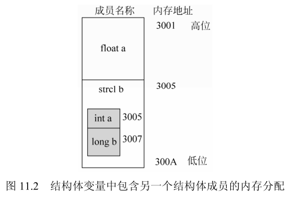

## 结构体类型变量的定义和引用

结构体是一种复合数据类型，它由不同数据类型的存储单元组合。

### 结构体类型变量的定义

在定义结构体类型变量之前，首先需要设计结构体，定义结构体的名称和成员的数据类型，然后使用结构体说明变量，这时结构体就成为了一种新的数据结构。定义结构体使用修饰符 struct，它一般形式如下：

```c++
struct 结构体名
{  
    成员项列表
};
```

结构体名是该结构体独一无二的名称，命名规则与变量命名相同。成员项列表是结构体中数据成员的数据类型和名称，数据成员可以是变量、数组或者其他结构体等复合数据结构。成员项列表的一般形式如下：

```c++
数据类型 成员名1;
数据类型 成员名2;
数据类型 成员名3;
```

```c++
struct student {
    char name[50];
    char dept[50];
    long no;
    float score[4];
};
```


结构体定义后，并没有在内存中为该结构体划分存储空间，它只是作为一种数据结构存在。只有在使用结构体类型声明变量后，系统才用该结构体分配内存空间给变量。使用结构体声明变量的一般形式如下：

```c++
struct 结构体名 结构体变量名
```

该语句只能在结构体定义后出现，如下例所示。

```c++
struct student stu1, stu2;
```

结构体变量的声明还有其他形式，例如直接在定义结构体的同时声明变量，或者省略结构体名直接定义结构体类型的变量。如下例：

```c++
struct student {

} stu1, stu2;

struct {

} stu1, stu2;
```

这两种用法使结构体丧失了通用性，特别是省略结构体名的做法，这样结构体就不能在源代码中的其他部分声明更多的结构体变量。在编写大型程序的源代码时，结构体定义部分通常放在头文件中，使用时包含该头文件即可，这样一个结构体不需要在程序的不同文件中反复定义。

### 结构体类型变量的引用

引用结构体变量的数据需要同时给出结构体变量名和数据成员名。引用结构体变量的一般形式如下

```c++
结构体变量名.数据成员名
```

它们之间用“.”操作符分隔。

这两种符号的优先级高于算术运算符和赋值符号，所以结构体变量的成员与普通的变量或数组使用方法完全相同。

### 结构体类型变量的初始化

结构体汇集了不同的数据类型，为结构体类型变量初始化就略显复杂，需要考虑初始化数据与结构体成员项数据类型的匹配。如下例所示：

```c++
struct student stu1 = {"Tom", "Math", 1, 98.2, 32.3, 23.4, 34.5};
```

这种初始化方法的原理是，结构体的成员在内存的连续空间中顺序存储，从结构体的首地址开始依次将相匹配的数据类型保存在对应的内存单元中。如果结构体中以另一个结构体作为成员项，如下例：

```c++
struct strc1 {
    int a;
    long b;
};

struct strc2 {
    float a;
    struct strc1 b;
};

struct strc2 x;
```

那么结构体变量ⅹ中各成员的分配仍然是在连续空间中，结构体变量ⅹ的成员项 b 在内存空间中的总长度为结构体 strc1 定义的长度，分布形式如 strc1 定义的顺序，如图 11.2 所示。



## 结构体数组的定义和引用

当需要使用大量相同的结构体变量时，可使用结构体定义数组，该数组包含与结构体相同的数据结构所组成的连续存储空间。

## 结构体指针的定义和引用

C 语言中指针的操作非常灵活，它能指向结构体变量对结构体变量进行操作。在学习结构体指针之前，需要再次加深对指针的认识。声明指针变量时所使用的数据类型修饰符实际上的作用是定义指针访问内存的范围。如果指针定义为整型，那么该指针访问内存的范围就是整型变量在内存中所占用的空间大小。虽然每次尝试将指针变量所储存的内存地址输出会发现，任何类型的内存地址长度都是一样，但不同类型间不能相互复制，只有空值型除外。因此在使用指针操作结构体时，一定要确定指针所定义的数据类型与结构体的数据类型相同。

### 指向结构体类型变量的使用

定义结构体变量的一般形式是：

```c++
结构体名 *结构体变量名
```

结构体名作为指针变量的类型修饰符。引用结构体指针所指向的结构体变量成员需要使用“->”操作符，该操作符由减号“-”和小于号“>”组合而成。如下列源代码：

```c++
typedef stuct student stud_t;

stud_t stu1 = {"Tom", "Math", 1, 98.2, 32.3, 23.4, 34.5};
stud_t *p;
p = &stu1;
p -> no = 12334;
```

代码中使用了 `typedef` 命令，该命令用于定义新的数据类型修饰符。执行 `typedef` 命令后，`stut` 成为了 `student` 结构体类型修饰符，在代码中 `stut` 的作用等同于 `struct student`。

指针 `*p` 被指向结构体变量 `stu1`，但指针 `*p` 并不是结构体变量，所以不能使用 “.”符号引用结构体成员，只能使用“->”操作符。

在设计一些需要大量交换数据的程序时，需要动态为数据划分内存。当不再需要该数据时，可以从内存中释放，以节省程序运行时占用的内存空间。下例将演示为结构体指针动态分配内存的操作方法。

```c++
stu_t *p = (stu_t *)malloc(sizeof(stu_t)); //为结构体指针划分内存空间
p -> no = 2009;
free(stu_t); //使用完毕后释放该内存空间
```

在为结构体动态分配内存空间时，使用 `sizeof` 函数计算结构体 `stut` 在内存中所需要的空间，然后使用 `malloc` 函数将 `sizeof` 函数返回的数量在内存中划分出来。`malloc` 函数的返回值是该内存空间的首地址，所以用强制转换表达式将 `malloc` 返回的地址转换为 `stut` 类型的指针。

### 指向结构体类型数组的指针的使用

结构体类型数组本质上是作为数组存在，数组的元素是结构体变量。结构体数组的名称即是指向该数组第一个数组元素的指针。结构体数组元素之间不能直接相互复制数据。

下面将介绍通过指针直接访问内存空间复制结构体数组元素的方法。

```c++
#include <stdio.h>
#include <string.h>

struct student {
    char name[50];
    char dept[50];
    long no;
    float score[4];
};

typedef struct student stu_t;

int main() {
    stu_t stu_a[2] = {"Tom", "Math", 1, 98.2, 32.3, 23.4, 34.5};
    stu_t *p = stu_a;
    memcpy(p + 1, p, sizeof(stu_t));
    puts((p + 1)->name);
    return 0;
}
```

程序中定义了结构体数组 stua，在初始化时为其第 1 个元素赋值。定义指针 `*` 时，用数组名 `stu_a` 为指针 `*` 赋值，指针 `*` 指向了数组 `stua` 第 1 个元素。`memcpy`（函数的作用是将内存中从指针 `*p` 指向的地址开始长度为 `sizeof(stut)` 的数据，复制到内存中指针 `*p+1`

指向的地址开始长度为 `sizeof(stut)` 的空间里。由此可见，对指针 `*p+1` 进行的操作，**并非简单的将内存地址作为整型数据进行加 1 运算**，1 代表的是 `sizeof(stut)` 的长度的**内存区间所跨越地址的差值**。

## 共用体

共用体又称为联合体，是由不同数据类型组成的一个整体。与结构体不同的是，**共用体每次只能使用其中一个成员**。结构体的总长度是结构体所有成员长度之和，**共用体的总长度是其中最长一个数据类型的长度**，共用体的所有成员共享这一存储空间。在一些场合中，只需要使用某一类型的变量而其他类型的变量暂时不需要使用。当使用另一类型变量时，原先的变量也转为与程序无关，这种情况下可使用共用体节省同时存在多种数据类型变量所需要的额外空间。

### 共用体的定义

定义共用体使用修饰符 union，一般形式是：

```
union 共用体名 {
    成员项列表
}
```

共用体名是该共用体独一无二的名称，命名规则与变量命名相同。成员项列表是共用体中数据成员的数据类型和名称，数据成员可以是变量、数组或者其他结构体等复合数据结构，各成员通常不使用相同的数据类型。成员项列表的一般形式为：

```
数据类型成员名1;
数据类型成员名2;
数据类型成员名3;
```

使用共用体声明变量的一般形式是：

```
union 共用体名 共用体变量名；
```

该语句只能在共用体定义后出现。如下例：

```c++
union unidata{
    char a;
    int b;
    long c;
    double d;
};

union unidata x;
```

共用体成员中，长度最长的是双精度浮点型d，共用体变量ⅹ的长度为双精度浮点型数据类型的长度，内存分配形式如图11.3所示。


### 共用体变量的引用

共用体变量的引用方式与结构体变量相同，一般形式为：

```
共用体名.成员名
```

但共用体一次只能使用一个成员。如下例：

```c++
#include <stdio.h>

union unidata {
    char a;
    int b;
    long c;
    double d;
};

union unidata x;

int main() {
    x.a = 65;
    printf("x.a=%c\n", x.a);

    x.b = 100;
    printf("x.b=%d\n", x.b);

    x.c = 100000400;
    printf("x.c=%ld\n", x.c);

    x.d = 0.323434;
    printf("x.d=%f\n", x.d);

    return 0;
}
```

最后一次输出的结果为不可预知的，因为共用体ⅹ的存储空间中已经被成员 xd 使用过，而输出成员ⅹ.a 前，没有重新为成员ⅹ a 赋值，这时如果引用成员ⅹ.a 的数据，获得的是成员 xd 的一部分数据，所以输出结果可能因系统环境的不同而有差异。
