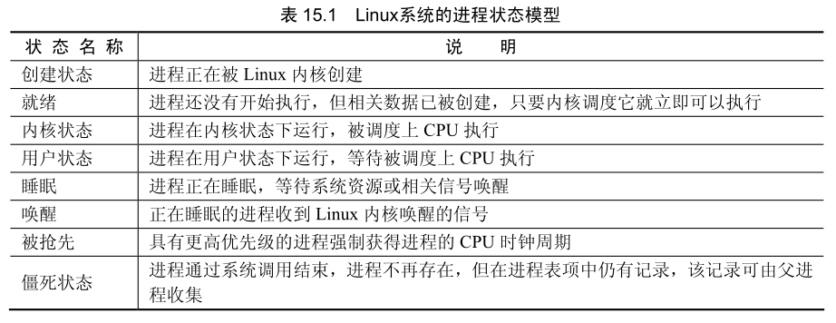
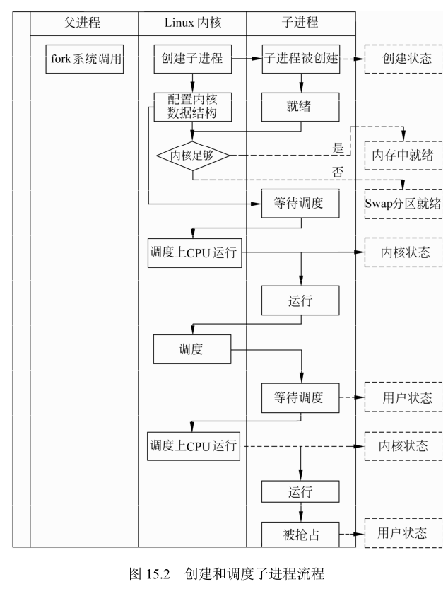
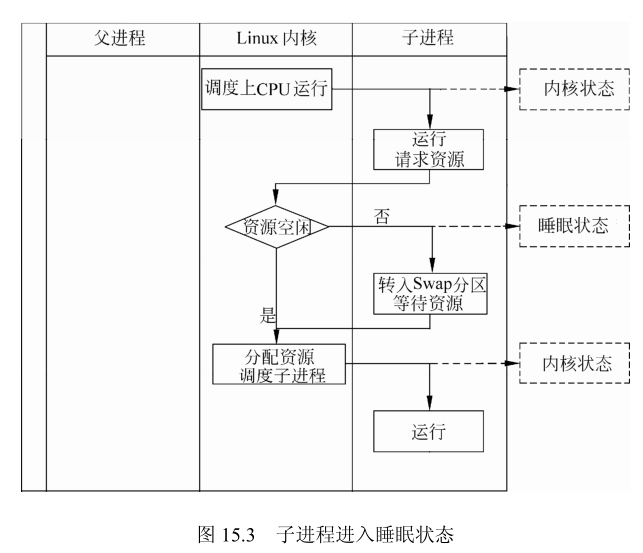
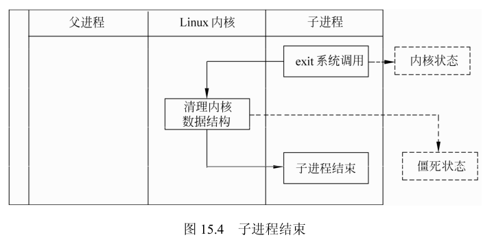
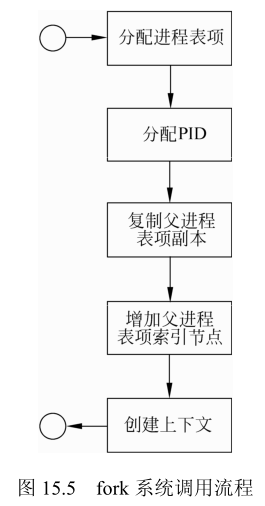
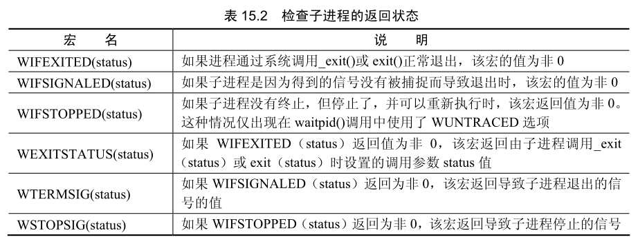

Linux 系统是多仼任务操作系统，可同时进行多个程序完成多项工作。进程是处于活动状态的程序，在操作系统的管理下，所有进程共享计算机中的硬件资源。进程作为系统运行时的基本逻辑成员，不仅作为独立个体运行在系统上，而且还将相互竞争系统资源。了解进程的本质对于理解、描述和设计系统软件有着极为重要的意义，了解进程的活动状态也有利于设计复杂的程序。

## 进程的基本概念

### 进程的状态和状态转换



1. 子进程被 Linux内核调入CPU执行的过程

进程的生命周期包括从创建到退出的全部状态转化，它的生命周期里并不一定要经历所有的状态。父进程创建子进程，子进程被 Linux 内核调λ CPU 执行的过程可用跨职能流程图来反映，如图 15.2 所示。



最初，父进程通过 fork 系统调用创建子进程，子进程被创建后，处于创建状态。Linux 内核为子进程配置数据结构。如果内存空间足够，子进程在内核中就绪，否则在 Swap 分区就绪。这时子进程处于就绪状态，等待 Linux 内核调度，Linux 内核会为子进程分配 CPU 时钟周期，在合适的时间将子进程调度上 CPU 运行，这时子进程处于内核状态，子进程开始运行。被分配的 CPU 时钟周期结束时，Linux 内核再次调度子进程，将子进程调出 CPU，子进程进入用户状态待子进程被分配到下一个 CPU 时钟周期到来时，Linux 内核又将子进程调度到 CPU 运行，使子进程进入内核状态。如果有其他的进程获得更高优先级，子进程的时钟周期可能会被抢占，这时又会回到用户状态。

2. 子进程进入睡眠状态

子进程在运行时，如果请求的资源得不到满足将进入睡眠状态，睡眠状态的子进程被从内存调换到 Swap 分区。被请求的资源可能是一个文件，也可能是打印机等硬件设备如果该资源被释放，子进程将被调入内存，继续以系统状态执行，如图 15.3 所示。



3. 子进程结束

子进程可以通过 exit 系统调用结束，这时子进程将进入到僵死状态，生命周期结束，如图 15.4 所示。



子进程在内核中的数据结构又被称为上下文。上下文包括3个部分：用户级上下文是子进程用户空间的内容；寄存器上下文是子进程运行时装入CPU寄存器的内容；系统级上下文是子进程在 Linux内核中的数据结构。

子进程切换时，CPU收到一个软中断，这时上下文将被保存起来，称之为保存现场子进程再次运行时，上下文被还原到相关位置，称之为还原现场。整个过程称为上下文切换，保存上下文的数据空间称为u区，是 Linux内核为进程分配的存储空间。内核在以下情况会进行上下文切换操作：

- 子进程进入睡眠状态时。
- 子进程时钟周期结束，被转为用户状态时。
- 子进程再次被调度上CPU运行，转为系统状态时。
- 子进程僵死时。

### 进程控制

在 Linux 系统中，用户创建子进程的唯一方法就是使用 fork 系统调用。fork 系统调用的流程如图 15.5 所示。



首先，Linux 内核在进程表中为子进程分配一个表项，然后分配 PID。子进程表项的内容来自于父进程，fork 系统调用会将父进程的进程表项复制为副本，并分配给子进程。然后，Linux 内核使父进程的文件表和索引表的节点自增 1，创建用户级上下文。最后，将父进程上下文复制到子进程的上下文空间中。fork 系统调用结束后，子进程的 PID 被返回给父进程，而子进程获得的值为 0。

最简单的进程控制为结束进程，通过 exit 系统调用实现。进程执行 exit 系统调用后，Linux 内核将删除进程的上下文，但保留进程表项，进程处于僵死状态。待合适的时候，再删除进程表项中的内容，释放进程 PID。

父进程与子进程的同步是通过wait系统调用实现的。父进程调用 waito函数后，父进程的执行被阻断，直到子进程进入僵死状态。这时，子进程的退出参数可通过 waito函数返回给父进程。wait系统调用常被用来判断子进程是否已结束。

除此以外，进程可使用 exec 系统调用运行一个可执行文件。该 exec 和 fork 系统调用的区别是，**exec 系统调用会结束原有进程，使用更新上下文的内容，并从头开始执行一个新的进程**。两个进程之间并无父子关系。

### 进程调度

Linux 系统是分时操作系统。Linux 内核可同时执行多个进程，并为每个进程分配 CPU 时钟周期。当一个进程的时钟周期结束后，Linux 内核会调度另一个进程上 CPU 执行，如此往复。这种调度方法属于多级反馈循环，Linux 内核会为每个进程设定优先级。如果有进程处于较高的优先级，那么它能够抢占较低优先级进程的 CPU 时钟周期。

Linux 系统进程调度包括两个概念，分别是调度时机和调度算法。调度时机指进程何时被调度上 CPU 执行。例如，转变为睡眠状态的进程将获得较高的优先级，一旦所需要的资源被释放，该进程可以立即被调度上 CPU 执行。被抢占的进程也将获得一个较高的优先级，抢占其 CPU 时钟周期的进程一旦转为用户状态，被抢占的进程立即转为内核状态。调度算法所关心的内容就是如何为进程分配优先级。

为 Linux 设计程序时，通常不需要人为地设置进程的优先级，Linux 系统进程调度机制可保证所有进程都能获得足够的运行时间。

## 进程的基本操作

本节将通过介绍进程操作的系统调用函数来讲解进程的基本操作方法，包括 fork 调用 exec 调用、exit 调用、wait 调用和 slep 调用，相关函数被定义在系统调用库 unistd.h 中通过本节我们将了解如何产生子进程，进程如何改变它的执行映像，父子进程的同步等操作。由此也了解到一些并行程序的基本概念与如何设计简单的并行程序。

### fork系统调用

fork系统调用有两个函数，分别是 fork 函数和 vfork 函数。fork 系统调用可创建个子进程，该调用的一般形式是：

```c++
pid_t fork(void);
pid_t vfork(void);
```

其中，pid_t 是用来保存进程 PID 信息的结构体。当调用执行成功时，该调用对父进程返回子进程的 PID，对子进程返回 0。调用失败时返回 -1，子进程没有创建。vfork 函数与 fork 函数形式相同，它们之间的区别是 vfork 函数创建子进程时，不复制父进程的上下文。

```c++
#include <sys/types.h>//该头文件提供系统调用的标志
#include <sys/stat.h>//该头文件提供系统状态信息和相关函数
#include <sys/uio.h>//该头文件提供进程I/O操作的相关函数
#include <unistd.h>//标准函数库
#include <fcntl.h>//文件操作相关函数库
#include <string.h>//字符串操作函数库
#include <sys/wait.h>//wait调用相关函数库
#include <stdio.h>//标准输入与输出函数库
#include <stdlib.h>//常用工具函数库

int main() {
    char buf[100] = {0};//定义缓冲区
    pid_t cld_pid;//定义该结构保存子进程的PID
    int fd;
    int status;

    if ((fd = open("temp", O_CREAT | O_RDWR | O_TRUNC, 0664)) == -1) {
        perror("create file");
        exit(1);
    }

    strcpy(buf, "parent data");

    if ((cld_pid = fork()) == 0) {//创建子进程，并判断自己是否是子进程
        strcpy(buf, "child data");
        puts("child working:\n");
        printf("child PID %d\n", getpid());
        printf("parent PID %d\n", getppid());
        write(fd, buf, strlen(buf));
        close(fd);
        exit(0);
    } else {
        puts("parent working:\n");
        printf("parent PID %d\n", getpid());
        printf("child PID %d\n", cld_pid);
        write(fd, buf, strlen(buf));
        close(fd);
    }

    wait(&status);//等待子进程结束

    return 0;
}
```

由结果可知，父进程调用子进程后，父进程由内核状态转为用户状态，子进程开始执行并输出信息。然后子进程调用 exit 函数进入僵死状态。父进程由用户状态重新回到内核状态，并输出信息。最后父进程等待子进程结束，父进程结束。

子进程是从 fork 调用处开始执行的，因此 fork 调用不会被执行两次。代码中的 fork 调用返回给父进程和子进程的值不同，因此可于用于区分哪个是父进程，哪个是子进程。

### exec系统调用

系统调用 exec 以新进程替代原有进程，但是 PID 保持不变。因此可以认为，exec 系统调用实际上没有创建新进程，只是替换了原有进程上下文的内容。它共有 6 个函数，代码如下：

```c++
int execl(const char *path, const char *arg, ...);
int execlp(const char *file, const char *arg, ...);
int execle(const char *path, const char *arg, ..., char *const envp[]);
int execv(const char *path, char *const argv[]);
int execve(const char *paht, char *const argv[], char *const envp[]);
int execvp(const char *file, char *const argv[]);
```

在使用这些函数前，必须在程序中定义全局变量，如下：

```c++
extern char **environ;
```

该变量是预定义用来指向 Linux 系统全局变量的指针，这样就能在当前工作目录执行系统程序，正如在 shell 中可不输入路径直接运行 Ⅵ 和 GCC 等程序。

exec 系统调用的函数中，execve 函数是另外 5 个函数的基础。这些函数的区别可以总结成以下 3 条：

（1）待执行程序文件是由文件名还是由路径名指定。第一个参数为`*file`的是文件名，为`*path`的即路径名。

（2）新程序的参数是一一列出还是由一个指针数组来引用。execl 函数和 execlp 函数是将参数一一列出； execle 函数将参数一一列出，但可以用指针数组引用环境变量； execv 函数和 execvp 函数的参数由一个指针数组来引用；execve 函数的参数用一个指针数组来引用，还用另一个指针数组引用环境变量。

（3）把调用进程的环境传递给新程序还是给新程序指定新的环境。execle 函数和 execve 函数为新程序指定新的环境。

所有这 6 个函数的执行效果是一样的，在执行成功时，函数的返回值为 0，否则返回 1。

下例将展示 execve 函数的用法。

```c++
//这是第一个文件，被调用者，文件名为 beexec.c
#include <stdio.h>
#include <unistd.h>

extern char **environ;//声明全局变量，用于保存环境变量信息

int main(int argc, char *argv[]) {
    int i;

    puts("output args: ");
    for (i = 0; i <= argc; i++) {
        printf("%d=%s\n", i, argv[i]);
    }

    puts("output environ: ");
    for (i = 0; environ[i] != NULL; i++) {
        printf("%s\n", environ[i]);
    }
}
```

```c++
//这是第二个文件，调用者，文件名为 doexec.c
#include <stdio.h>
#include <unistd.h>

extern char **environ;//声明全局变量，用于保存环境变量信息

int main(int argc, char *argv[]) {
    puts("input test 1");

    execve("beexec", argv, environ);

    puts("input test 2");
}
```

```c++
gcc -o doexec doexec.c
gcc -o beexec beexec.c
```

该例是由两个程序所组成，必须分开编译。第 1 个程序名为 beexec，用于将第 2 个程序传递给它的参数和环境变量输出。执行第 2 个程序，puts 函数向缓冲区输入了一条信息后使用 execve 系统调用使 beexec 替换原进程的执行映像。例如，输入的命令为：

```c++
./doexec test1
```

通过结果会发现，doexec.c 程序在调用 execve 函数前的一条输岀语句没能输出到终端，原因是 doexec.c 程序的输岀语句可能还存在于缓冲区中。当调用 beexec.c 程序时，缓冲区被后者清空。如果不希望这样的情况发生，可使用 `fflush(stdout)` 语句将标准输出的缓冲区内数据强制输出。

### exit系统调用

系统调用 exit 的功能是终止发出调用的进程，它包含两个函数，分别是 _exit 函数和 exit 数。它们的一般形式如下：

```c++
void _exit(int status);
void exit(int status);
```

系统调用 _exit 立即终止发岀调用的进程。所有属于该进程的文件描述符都关闭。如果该进程拥有子进程，那么父子进程关系被转到 init 进程上。被结束的进程将收到来自子进程的僵死信号 SIGCHLD。如果被结束的进程在控制台或终端上运行，shell 程序将收到 SIGHUP 信号。

函数中的参数 status 是返回给父进程的状态值，父进程可通过 wait 系统调用获得。status 只有最低 1 个字节能被父进程读取，由此可知，实际值域范围为 0 ~ 255。

系统调用 _exit 没有返回值，被终止进程不会知道该调用是否成功。另外，该调用不会刷新输入输出缓冲区，因此进程结束前必须自己刷新缓冲区，或者改用 exit 系统调用。

exit 系统调用将进行一些上下文清理工作，例如释放所有占用的资源、清空缓冲区等。

在由 fork 函数创建的子进程分支里，正常情况下使用 exit 函数是不正确的，这是因为使用它会导致标准输入输岀的缓冲区被清空两次，而且临时文件可能被意外删除。

### wait系统调用

系统调用 wait 用于父进程与子进程同步。父进程调用后，将进入睡眠状态，直到子进程结束或者父进程再被其他进程终止。使用 wait 系统调用需要包含头文件 sys/types.h 和sys/wait.h。该调用有两个函数，分别是 wait 和 waitpid，它们的一般形式如下：

```c++
pid_t wait(int *status);
pid_t waitpid(pid t pid, int *status, int options);
```

发出 wait 系统调用的进程进入睡眠状态，直到它收到一个子进程的僵死信号，或者是收到其他重要的信号。如果父进程在 wait 系统调用的同时子进程进入僵死状态，wai 系统调用会立即结東。参数* status 用来获得子进程 exit 系统调用的参数值，只有最低 1 个字节能被读取。

调用 waitpid 函数与调用 wait 函数的区别是，wait 函数等待所有子进程的僵死状态，而 waitpid 函数等待 PID 与参数 pid 相关的子进程僵死状态。其中，参数 pid 的含义与取值方法如下

（1）当参数 pid 小于 -1 时，且退出的子进程的进程组 ID 等于绝对值的 pid 时结束等待。
（2）当参数 pid 等于 0 时，且该子进程的进程组 ID 等于发出调用进程的组 ID 时子进程退出。
（3）当参数 pid 大于 0 时，等待进程 ID 等于参数 pid 时子进程退出。
（4）当参数 pid 等于 -1 时，等待任何子进程退出，相当于调用 wait。

waitpid 函数中的参数 options 的取值范围及意义如下：

（1）WNOHANG，该选项要求如果没有子进程退出就立即返回。
（2）WUNTRACED，如果发现已经僵死，但未报告状态的子进程，父进程不进入睡眠状态，立即返回子进程的终止信息。

如果 status 参数不为 NULL，可通过该参数获得子进程的信息。下列宏能用来检查子进程的返回状态，见表 15.2。



### sleep函数调用

系统调用 sleep 用来使进程主动进入睡眠状态。该函数的一般形式是：

```c++
sleep(秒数);
```

执行该系统调用后，进程将进入睡眠状态，直到指定的秒数已到。正常情况下，该调用的返回值为0，若是因为被信号所唤醒，则返回值为原始秒数减去已睡眠秒数的差。

## 进程的特殊操作

第 15.2 节介绍了有关进程的一些基本操作，如进程的产生、进程的终止、进程执行映像的改变和等待子进程终止等。本节将要介绍一些有关进程的特殊操作。有了这些操作，就使得进程的编程更加完善，能编制更为实用的程序。主要的内容包括得到关于进程的各种 ID、对进程设置用户 ID、改变进程的工作目录、根交换和改变进程的优先级等操作。

### 获得进程ID

进程 ID 除了 PID 外，还有 UID、EUID、GID、EGID 和 PGID 这 5 个数值。

- UID 等于创建进程的用户信息。
- EUID 是创建进程的用户对进程所属可执行文件的操作权限信息，另外还包括是否有使用 kil 系统调用发送软中断信号到 Linux 内核结束进程的权限。
- GID 是创建进程的用户所属群组的信息。
- EGID 用于标识进程目前所属用户组，它与 GID 并不一定相同，因为进程执行时所属用户组可能改变。
- PGID 用于标识进程组信息。

获得运行进程的 GID 可使用 getid 函数，获得运行进程的 EGID 可使用 getegid 函数。

标识 GID 与 EGID 的不同是由于执行文件设置 set-gid 位引起的。这两个调用的一般形式如下：

```c++
gid_t getgid(void);
gid_t getegid(void);
```

如果要获得进程的 PID 可使用 getpid 函数，要获得父进程的 PID 可使用 getppid 调用。这两个调用的一般形式如下：

```c++
pid_t getpid(void);
pid_t getppid(void);
```

如果要获得进程的 PGID 可使用 getpgrp 函数，若要获得指定进程的 PGID 可使用 getpgid 函数。这两个调用的一般形式如下：

```c++
pid_t getpgrp(void);
pid_t getpgid(pid_t pid);
```

GID 和 PGID 的区别是，一般执行该进程的用户的组 ID 就是该进程的 GID，如果该执行文件设置了 set gid 位，则文件所群组⑩就是该进程的 GID。一个进程在 shell 中执行，shell 程序就将该进程的 PID 作为该进程组 PGID。从该进程派生的子进程都拥有父进程所属进程组 PGID，除非父进程将子进程的 PGI 设置成与该子进程的 PID 一样。

### setuid和setgid系统调用

设置进程的 UID 可使用 setuid 函数，设置进程的 GID 可使用 setgid 函数。这两个调用的一般形式如下：

```c++
int setuid(uid_t uid);
int setgid(gid_t gid);
```

setuid 函数可修改发出调用进程的 UID，参数 uid 为创建进程的用户信息。如果以普通用户的 UID 作为参数执行该调用，Linux 内核将直接设置进程 UID 为参数 uid 信息。如果以根用户的 UID 作为参数，为了保障系统的安全性，Linux 内核将以进程表和 u 区中用户真实的标识号来设置进程 UID。setuid 函数执行成功时，返回值为 0，否则返回 -1。

setgid 函数可修改发出调用进程的 GID，与前者不同，该调用不会检验用户的真实身份。参数 gid 为进程的新 GID 信息。执行成功时，返回值为 0，否则返回 -1。

setuid 数使用时要十分小心。当进程的 EUID 为根用户时，通过 setuid 函数设置 UID 为普通用户，则进程 UID 不能再被设置为根用户。如果某个进程创建初期需要根用户权限，完成相应任务后不再需要根用户权限，可为进程原始的可执行文件设置 setuid 信息，并将所有者设置为根用户。这样，进程创建时的 UID 为根用户，不需要根用户时，可用 setuid（getuid）表达式恢复进程的 UID 和 EUID 信息。

### setpgrp和setpgid系统调用

系统调用 setpgrp 和 setpgid 都是用来设置进程 PGID。它们的一般形式为：

```c++
int setpgrp(void);
int setpgid(pid_t pid, pid_t pgid);
```

其中，setpgrp 函数直接将进程的 PGID 设为与 PID 相同的数值，setpgid 以其中参数修改 PGID。参数 pid 为指定进程的 PID，值为 0 时修改发出调用进程的 PGID。参数 pgid 为指定的 PGD 信息，值为 0 时，修改所有 PID 与参数 pd 相等的进程，将这些进程的 PGID 值设为参数 pgid 的值。若以普通用户权限发出此调用，而 PGID 原本为根用户组所有，那么只有在指定进程与调用进程的 EUID 相同时，或者指定进程为调用进程的子进程时才有效。

### chdir系统调用

在文件操作部分曾介绍过 chdir 系统调用，该调用对于进程控制有不同意义。chdir 函数将进程的当前工作目录改为由参数指定的目录。该调用的一般形式如下：

```c++
int chdir(const char *path);
```

参数 path 为指定目录的路径，发出该调用的进程必须具备该目录的执行权限。调用成功时返回值为 0，否则返回 -1，并设置相应的错误代码。

### chroot系统调用

系统调用 chroot 又被称为根交换操作，作用通常是在一个 Linux 系统上虚拟另一个 Linux 系统，根交换后，所有的命令操作都被重新定向。该调用的一般形式如下：

```c++
int chroot(const char * path)
```

参数 path 为新的根目录路径，执行后，进程将以该目录作为根目录，并且使进程不能访问该目录以外的内容。该操作不改变当前工作目录，如果当前工作目录在指定目录以外，则无法访问其中的内容。根交换操作只能由根用户发出，调用成功时返回值为 0，错误时返回 -1，并设置相应的错误代码。

### nice系统调用

系统调用 nice 用来改变进程的优先级。该调用的一般形式如下：

```c++
int nice(int inc);
```

参数 inc 为调用 nice 函数的进程优先级数值的增量。优先级数值越低的值，被调度上 CPU 运行的机会越大；优先级数值越高，被调度上 CPU 运行的机会越低。但是，只有根用户能为 inc 参数设置负值，使进程优先级提高，普通用户设置的正值会降低优先级。当调用成功时，返回值为 0，否则返回 -1。
